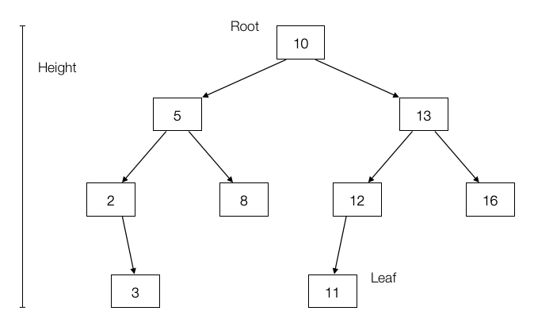

# Trees

## Overview

A tree is an acyclic, connected graph. In other words, any two vertices are
connected by _exactly_ one path. Conventional tree operations are _insert_,
_search_, _remove_, and _traverse_.

- The **root** indicates the top of the tree.
- **Leaves** refer to nodes with no children.
- A **parent** is the node above the current one. A **child** is the node below
  the current one.
- The **depth** of a node _n_ is the number of nodes on the search path from
  root to /n, not including _n_ itself.
- The **height** of a tree is the maximum depth of any node.
- A **level** of a tree is all nodes at the same depth.
- A node is an **ancestor** of _d_ if it lies on the search path from the root
  to _d_. If a node is an ancestor of _d_, we say _d_ is a **descendant** of
  that node.
- A tree is **balanced** when every path from root to leaf has the same length.

## Binary Search Tree



A **binary tree** is recursively defined as being empty or consisting of a root
node with left and right subtrees. A **binary _search_ tree** (BST) labels each
node in a binary tree with a single key such that for any node labeled $x$, all
nodes in the left subtree have $keys < x$ while all nodes in the right subtree
have $keys > x$.

- ∀ y ∈ left subtree of x, y ≤ x
- ∀ y ∈ right subtree of x, y ≥ x

Binary tree nodes have left and right pointer fields, an optional parent
pointer, and a data field.

```python
from dataclasses import dataclass

@dataclass
class Tree:
    item: Any
    left: Optional[Tree] = None
    right: Optional[Tree] = None
    parent: Optional[Tree] = None
```

Binary search trees can be used to solve almost every data structures problem
reasonably efficiently. They offer the ability to efficiently search for a key
as well as find the _min_ and _max_ elements, look for the successor or
predecessor of a search key, and enumerate the keys in a range in sorted order.

### Traversal

Traversal involves visiting all nodes. **In-order** traversal of a binary search
tree can be done recursively with the following.

```python
def traverse(tree: Tree):
    if tree:
        traverse(tree.left)
        process(tree.item)
        traverse(tree.right)
```

Changing the position of `process` gives alternate traversal orders. Processing
the item first yields a **pre-order** traversal, while processing it last gives
a **post-order** traversal.

### Performance

_Search_, _insert_, and _delete_ all take $O(h)$ time, where $h$ is the height
of the tree. A perfectly balanced tree has $h = \lceil \log n \rceil$.
Unfortunately, inserting keys in sorted order produces a skinny linear height
tree, $h = n$. Randomizing insert order will produce $O(\log n)$ height on
average.

| Operation | Best Complexity | Worst Complexity |
| --------- | --------------- | ---------------- |
| Insert    | $O(\log n)$     | $O(n)$           |
| Search    | $O(\log n)$     | $O(n)$           |
| Delete    | $O(\log n)$     | $O(n)$           |

A binary search tree is **complete** if every node has zero or two children and
all leaves are at the same level.

### Balanced Search Trees

**Balanced binary search tree** data structures adjust the tree during
insertion/delete to guarantee that height will always be $O(\log n)$. Balanced
tree implementations include **red-black trees** and **splay trees**.
